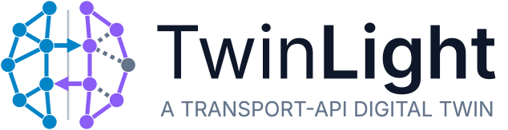

<div align="center">



**A multi-timescale digital twin of an optical network, behind standard T-API interfaces.**

[](https://github.com/carlosnatalino/TwinLight/actions/workflows/ci.yml)
[](LICENSE)
[](https://www.python.org/downloads/release/python-3120/)
[](https://www.opennetworking.org/)
[](https://gnpy.readthedocs.io/)

</div>

---

TwinLight is an optical network **digital twin**: it loads a GNPy network
description, computes a physics-based quality-of-transmission (QoT) baseline for
every lightpath, layers four literature-grounded models of *time-varying*
impairments on top, and exposes the result through the interfaces a real optical
domain controller would offer — [T-API v2.6.0][tapi] REST, gNMI streaming
telemetry, and a Prometheus metrics endpoint.

The result behaves like an optical domain controller you can experiment against:
useful for validating SDN control logic, running what-if and failure scenarios,
generating labelled monitoring data for machine-learning studies, and
reproducible network-planning research.

**What makes it a *multi-timescale* twin.** Most optical network simulators give
a single static QoT figure per lightpath. TwinLight combines two regimes in one
model:

| Timescale | What it captures | How |
|-----------|------------------|-----|
| **Slow / static** | Per-lightpath QoT baseline (GSNR, OSNR, CD, PMD, latency) | GNPy split-step propagation, or a self-contained closed-form GN/EGN kernel |
| **Fast / transient** | µs-to-diurnal fluctuations of those same metrics | Four analytical impairment models composed over the baseline (see [Physics](#physics)) |

Every OPM read — REST response, gNMI sample, or Prometheus scrape — is evaluated
at the current wall-clock time, so a subscriber sees a signal that *moves* the
way a deployed coherent receiver's telemetry moves.

## Table of contents

- [Feature overview](#feature-overview)
- [Quick start with Docker Compose](#quick-start-with-docker-compose)
- [Local installation (development)](#local-installation-development)
- [Usage](#usage)
- [Architecture](#architecture)
- [Physics](#physics)
- [Configuration](#configuration)
- [Example scenarios and GNPy reference data](#example-scenarios-and-gnpy-reference-data)
- [Development](#development)
- [Documentation](#documentation)
- [Citing TwinLight](#citing-twinlight)
- [References](#references)
- [License and acknowledgements](#license-and-acknowledgements)

## Feature overview

- **T-API v2.6.0 northbound** — context, topology, connectivity-service CRUD,
  path computation, equipment and photonic-media spectrum contexts, with
  RESTCONF-style errors and `application/yang-data+json` responses.
- **Two interchangeable physical-layer backends** — GNPy split-step propagation
  (default) or a dependency-free closed-form GN/EGN kernel, selected at startup.
- **Four time-varying impairment models** — EDFA gain-reservoir transients,
  polarization (PMD drift + PDL hinge model), equalization-enhanced phase noise,
  and environmental/thermal drift, each traceable to a published formulation.
- **QoT-aware RMSA** — k-shortest-path routing, first-fit spectrum assignment on
  a 6.25 GHz flexi-grid, and admission control against the required GSNR of the
  requested modulation format.
- **Streaming telemetry** — gNMI `Subscribe` in ONCE / STREAM / POLL modes over
  gRPC, served by a stateless adapter that calls the FastAPI app in-process.
- **Observability out of the box** — Prometheus `/metrics` plus a provisioned
  Grafana dashboard in the Compose stack.
- **Web UI** — a React SPA for topology, services, spectrum occupancy, path
  computation and live OPM charts.
- **Reproducibility** — snapshot/restore of the full connectivity and spectrum
  state, so an experiment can be re-run from a known checkpoint.

## Quick start with Docker Compose

The Compose stack is the recommended way to run TwinLight. It builds the twin,
the web UI, and a pre-provisioned Prometheus + Grafana pair, and needs nothing
installed beyond Docker.

```bash
git clone https://github.com/carlosnatalino/TwinLight.git
cd TwinLight
docker compose up --build
```

That is the whole setup. The GNPy reference topologies are provisioned inside
the image during the build (see [below](#example-scenarios-and-gnpy-reference-data)),
so there is no manual download step.

Once the stack reports healthy:

| URL | What you get |
|-----|--------------|
| <http://localhost:5173> | Web UI — topology, services, spectrum, live OPM |
| <http://localhost:8080/health> | Twin health check |
| <http://localhost:8080/docs> | Interactive OpenAPI documentation |
| <http://localhost:8080/data/tapi-common:context> | T-API context — the northbound entry point |
| <http://localhost:8080/metrics> | Prometheus exposition |
| <http://localhost:9090> | Prometheus UI |
| <http://localhost:3000> | Grafana (`admin` / `admin`); the dashboard is provisioned in the *TwinLight* folder and starred, so it appears under *Starred* on the home page |
| `localhost:50051` | gNMI gRPC endpoint |

The default scenario is **CORONET CONUS** — a 75-ROADM US continental backbone
with 198 fiber spans. To run the small two-site scenario instead:

```bash
docker compose run --rm --service-ports twin \
    twinlight --config /app/examples/twin_config.yaml --rest-host 0.0.0.0
```

Snapshots written by `POST /admin/snapshot` land in `./snapshots/` on the host,
and the stack restores the most recent one automatically on restart.

```bash
docker compose down          # stop the stack, keep Prometheus/Grafana volumes
docker compose down -v       # stop and discard the metric history too
```

> **Apple Silicon note.** One of GNPy's transitive dependencies
> (`oopt-gnpy-libyang`) publishes manylinux wheels for x86-64 only, so the twin
> image is built for `linux/amd64` and runs under Rosetta/QEMU on arm64 hosts.
> This is handled automatically; expect a slower first build.

## Local installation (development)

A local installation is **recommended for development only** — for evaluation and
experiments, prefer the Compose stack above.

TwinLight requires **Python 3.12** (GNPy is not yet compatible with newer
releases) and uses [`uv`][uv] for environment and dependency management.

```bash
# 1. Install uv (see https://docs.astral.sh/uv/ for other platforms)
curl -LsSf https://astral.sh/uv/install.sh | sh

# 2. Clone and create the environment
git clone https://github.com/carlosnatalino/TwinLight.git
cd TwinLight
uv venv --python 3.12
source .venv/bin/activate

# 3. Install TwinLight with its development dependencies
uv pip install -e ".[dev]"

# 4. Provision the GNPy reference topologies used by the examples
twinlight-fetch-examples
```

<details>
<summary>Using plain <code>pip</code> instead of <code>uv</code></summary>

`uv` is the supported path — it resolves the dependency tree in seconds and
installs GNPy's native dependencies reliably on both x86-64 and arm64. If you
prefer `pip`, this is a standard PEP 621 package:

```bash
python3.12 -m venv .venv && source .venv/bin/activate
pip install -e ".[dev]"
```

</details>

The web UI is a separate npm workspace (Node 20+, **npm** — not pnpm or bun):

```bash
npm --prefix twinlight-ui ci      # reproducible install from package-lock.json
npm --prefix twinlight-ui run dev # dev server on http://localhost:5173
```

## Usage

### Run the twin

```bash
twinlight --config examples/coronet_conus_config.yaml    # 75-node backbone
twinlight --config examples/twin_config.yaml             # small two-site span
twinlight --config examples/twin_config.yaml --rest-port 8081 -vv
twinlight --config examples/twin_config.yaml --physics-backend egn
```

`--physics-backend {gnpy,egn}` overrides `physics.backend` in the YAML file; CLI
arguments always win over the configuration file.

### Create a connectivity service

Services are created through the standard T-API connectivity endpoint. Pick two
service-interface-point (SIP) UUIDs from
`GET /data/tapi-common:context/service-interface-point`, then:

```bash
curl -X POST http://localhost:8080/data/tapi-connectivity:connectivity-context/connectivity-service \
  -H "Content-Type: application/json" \
  -d '{
    "tapi-connectivity:connectivity-service": {
      "name": [{"value-name": "service-name", "value": "demo-link"}],
      "modulation-format": "DP-16QAM",
      "end-point": [
        {"local-id": "a-end", "service-interface-point": {"service-interface-point-uuid": "<SIP_A_UUID>"}},
        {"local-id": "z-end", "service-interface-point": {"service-interface-point-uuid": "<SIP_Z_UUID>"}}
      ]
    }
  }'
```

The twin computes candidate paths, assigns spectrum first-fit, and admits the
request only if the propagated GSNR clears the format's required GSNR plus the
configured system margin. `DP-QPSK`, `DP-16QAM` and `DP-64QAM` are supported.

### Populate the twin with demo services

An empty twin has nothing to monitor. This script creates one service per
modulation format between random endpoint pairs, so the monitoring, spectrum and
services views have something to show. It needs only the standard library, so it
works against a twin running anywhere — including the Compose stack.

Endpoint pairs are retried because admission is genuinely allowed to fail: a
`409` means no route, no contiguous spectrum, or a GSNR below the format's
threshold. Higher-order formats need more GSNR, so `DP-64QAM` will usually take
more attempts than `DP-QPSK`, and on a long-haul topology it may not be
admissible at all.

```bash
python3 - <<'PY'
import json, random, urllib.request
from urllib.error import HTTPError

BASE = "http://localhost:8080"
ATTEMPTS = 300

ctx = json.load(urllib.request.urlopen(f"{BASE}/data/tapi-common:context/service-interface-point"))
sips = ctx["tapi-common:context"]["service-interface-point"]
if len(sips) < 2:
    raise SystemExit("Need at least 2 service interface points")

for modulation in ("DP-QPSK", "DP-16QAM", "DP-64QAM"):
    name = f"demo-{modulation}-{random.getrandbits(16):04x}"
    for attempt in range(1, ATTEMPTS + 1):
        a, z = random.sample(sips, 2)
        body = {"tapi-connectivity:connectivity-service": {
            "name": [{"value-name": "service-name", "value": name}],
            "modulation-format": modulation,
            "end-point": [
                {"local-id": "a-end", "service-interface-point": {"service-interface-point-uuid": a["uuid"]}},
                {"local-id": "z-end", "service-interface-point": {"service-interface-point-uuid": z["uuid"]}},
            ],
        }}
        req = urllib.request.Request(
            f"{BASE}/data/tapi-connectivity:connectivity-context/connectivity-service",
            data=json.dumps(body).encode(), method="POST",
            headers={"Content-Type": "application/json"},
        )
        try:
            svc = json.load(urllib.request.urlopen(req))["tapi-connectivity:connectivity-service"]
        except HTTPError as exc:
            # 409 = not admissible on this pair (no route / no spectrum / QoT
            # below threshold). Anything else is a real error worth surfacing.
            if exc.code == 409:
                continue
            print(f"{modulation}: HTTP {exc.code} — {exc.read().decode()[:200]}")
            break
        uuid = svc["uuid"]
        opm = json.load(urllib.request.urlopen(f"{BASE}/internal/opm/{uuid}"))["measurements"]
        slot = svc.get("frequency-slot", {})
        print(f"{modulation:<9} {name}  attempt {attempt}")
        print(f"            uuid   {uuid}")
        print(f"            GSNR   {opm['gsnr-db']:.2f} dB   OSNR {opm['osnr-db']:.2f} dB")
        print(f"            slot   {slot.get('nominal-central-frequency')} THz / {slot.get('slot-width')} GHz")
        break
    else:
        print(f"{modulation:<9} not admissible after {ATTEMPTS} attempts")
PY
```

Then open the **Monitoring** page in the web UI, or watch one over gNMI with
`twinlight-client`. To clear them again, delete each service by UUID with
`DELETE /data/tapi-connectivity:connectivity-context/connectivity-service={uuid}`.

> **Why a printed GSNR can sit below the format's threshold.** Admission tests
> the *static* QoT baseline, while the GSNR printed above is the *live* reading
> with the transient models applied. On a long path the two differ
> substantially — a lightpath admitted at a 12.4 dB baseline can read ~5 dB once
> EDFA gain excursions are included. That is the twin behaving as intended: a
> deployed lightpath really can drift below its threshold between provisioning
> and operation. Set `transients.*.enabled: false` (or `POST /config/set`) to
> see the baseline the admission decision actually used.

### Stream live OPM

The companion client library and CLI ship in the same distribution:

```bash
twinlight-client                                              # localhost defaults
twinlight-client --rest-url http://host:8080 --gnmi-target host:50051
```

It lists the active services, lets you pick one, and streams its transient-aware
OPM (OSNR, GSNR, pre-FEC BER, Q-factor, chromatic dispersion, PMD) over gNMI.

### Checkpoint and restore

```bash
curl -X POST http://localhost:8080/admin/snapshot            # -> snapshots/twin-<ISO8601>.json
twinlight --config examples/twin_config.yaml --restore-latest
twinlight --config examples/twin_config.yaml --restore snapshots/twin-….json
```

Snapshots record the physical-layer backend that produced them; restoring one
under a different backend is rejected rather than silently reinterpreted.

## Architecture

```
twinlight-ui (React SPA)            ← port 5173
      │ HTTP polling + REST
      ▼
FastAPI application (src/twinlight) ← port 8080
      │ owns all state: topology, services, spectrum, physics, RMSA
      ▼
PhysicalBackend (Protocol)
   ├─ GnpyBackend   ← gnpy split-step propagation (default)
   └─ EgnBackend    ← closed-form GN/EGN kernel, self-contained
      +
NetworkX DiGraph                    ← routing graph
      +
Transient layer                     ← four analytical impairment models

gNMI gRPC server                    ← stateless adapter, port 50051
```

Two design rules shape the codebase:

1. **The FastAPI application owns all state.** The gNMI/gRPC server is a protocol
   adapter with no state of its own — it calls the same FastAPI app in-process
   through `httpx.ASGITransport`, so there is no TCP round-trip and no second
   cache to keep coherent.
2. **T-API surfaces stay standard.** Anything non-standard — OPM readings, path
   metadata, admin utilities — lives under separate `/internal/` and `/admin/`
   prefixes, so a T-API client never meets a proprietary extension inside a
   standard path.

See [docs/ARCHITECTURE.md](docs/ARCHITECTURE.md) for the module-level tour and
[docs/API.md](docs/API.md) for the full endpoint reference.

## Physics

### QoT baseline

Each admitted lightpath is propagated once and cached. Two backends are
available, selected by `physics.backend` or `--physics-backend`:

| Backend | Method | Notes |
|---------|--------|-------|
| `gnpy` (default) | Split-step propagation over the designed network, 88-channel C-band comb | Needs a GNPy equipment library; the reference implementation of the GN/EGN model [[10]](#ref-10) |
| `egn` | Closed-form GN/EGN kernel in `physics/egn_kernel.py` | No extra dependency, no equipment file needed; follows Carena *et al.* [[8]](#ref-8) [[9]](#ref-9) |

Both produce a backend-agnostic `OpmBaseline` that the transient layer perturbs,
so results stay comparable across backends.

### Time-varying impairments

Four models compose over the baseline through a QoT combiner with separate GSNR
and OSNR tracks. GSNR receives all four; OSNR receives only the models with a
physical route to the optical domain — EEPN is a DSP-domain impairment and is
deliberately excluded from OSNR.

| Model | Effect | Formulation | Timescale |
|-------|--------|-------------|-----------|
| **EDFA gain reservoir** | ΔGSNR, ΔOSNR | Exponential step response of the erbium reservoir, asymmetric add/drop time constants, cascaded in dB — Bononi & Rusch [[1]](#ref-1), Sun *et al.* [[2]](#ref-2), Tancevski *et al.* [[3]](#ref-3) | µs–ms |
| **Polarization** | ΔPMD, PDL→OSNR penalty | PMD drift accumulated in quadrature (Gordon & Kogelnik [[4]](#ref-4)); PDL as a cascade of discrete hinges with Maxwell-distributed per-hinge PDL and incommensurate drift — Zarkosvky & Shtaif [[5]](#ref-5), applied to coherent systems per D'Amico [[15]](#ref-15) and Miotto [[16]](#ref-16) | 90 s / 300 s |
| **Phase noise (EEPN)** | ΔGSNR | Dispersion-dependent equalization-enhanced phase noise, `α = π·c/(2f₀²)·|D_t|·B·Δν_LO` — Shieh & Ho [[11]](#ref-11), linewidth model per Henry [[12]](#ref-12) | ~120 s |
| **Environmental** | ΔCD, fiber-loss penalty | Thermal dispersion drift `dD/dT` and loss variation over a diurnal cycle — Kato *et al.* [[13]](#ref-13) | 86 400 s |

Pre-FEC BER and Q-factor are recomputed from the perturbed GSNR using the
Gaussian approximation for coherent DP-QAM [[14]](#ref-14).

Known simplifications relative to the source literature are documented in
[docs/PHYSICS.md](docs/PHYSICS.md) — read it before drawing quantitative
conclusions from the twin.

### Modulation formats

| Format | Bits/symbol | Required GSNR | Baud rate |
|--------|-------------|---------------|-----------|
| DP-QPSK | 2 | 8.5 dB | 32 Gbaud |
| DP-16QAM | 4 | 14.5 dB | 32 Gbaud |
| DP-64QAM | 6 | 20.5 dB | 32 Gbaud |

## Configuration

TwinLight is configured with a YAML file that references GNPy JSON topology and
equipment files and adds twin-specific sections. All relative paths resolve from
the YAML file's own directory.

```yaml
gnpy:
  topology: "gnpy-data/CORONET_CONUS_Topology.json"
  equipment: "gnpy-data/eqpt_config.json"
  no_insert_edfas: true        # topologies with bare fiber spans

physics:
  backend: gnpy                # gnpy | egn

transients:
  edfa_reservoir: { enabled: true,  tau_ms: 10.0 }
  polarization:   { enabled: true,  pdl_per_roadm_db: 0.5, pdl_per_edfa_db: 0.1 }
  phase_noise:    { enabled: true,  lo_linewidth_hz: 100000.0 }
  environmental:  { enabled: false, temp_variation_c: 5.0 }

rmsa:
  k_shortest_paths: 5
  qot_margin_db: 1.5           # system margin

spectrum:
  num_slots: 768               # 768 × 6.25 GHz = 4.8 THz C-band
  slot_width_ghz: 6.25
```

Every field, its default and its literature justification are documented in
[docs/CONFIGURATION.md](docs/CONFIGURATION.md), and the shipped example files are
extensively commented.

## Example scenarios and GNPy reference data

Two scenarios ship with the project:

| Scenario | Topology | Scale |
|----------|----------|-------|
| `examples/twin_config.yaml` | `edfa_example_network` | 2 transceivers, inline EDFAs |
| `examples/coronet_conus_config.yaml` | CORONET CONUS | 75 ROADMs, 198 fiber spans |

Both reference network topologies and an equipment library that belong to the
[oopt-gnpy][gnpy-repo] project. **TwinLight does not redistribute those files.**
They are provisioned instead from the `gnpy` distribution that TwinLight already
installs as a dependency, which guarantees the topology schema matches the GNPy
version in use:

```bash
twinlight-fetch-examples          # populate examples/gnpy-data/
twinlight-fetch-examples --list   # show which files are needed, and why
twinlight-fetch-examples --force  # refresh after upgrading gnpy
```

The Docker image runs this during the build, so the Compose quick start needs no
manual step. See [examples/gnpy-data/README.md](examples/gnpy-data/README.md) for
the manual alternative.

Bringing your own topology needs no code change — point `gnpy.topology` at any
GNPy-format JSON file.

## Development

Contributions are welcome; please read [CONTRIBUTING.md](CONTRIBUTING.md) first.

The checks below are exactly what CI runs on every pull request
([`.github/workflows/ci.yml`](.github/workflows/ci.yml)):

```bash
pytest                                  # backend test suite
pytest --cov                            # … with coverage (floor: 60%)
ruff check .                            # lint
mypy                                    # static type checking
npm --prefix twinlight-ui test -- run   # web UI tests (vitest)
npm --prefix twinlight-ui run build     # web UI production build
```

CI additionally builds both Docker images and smoke-tests the twin image, so the
documented quick start cannot silently break.

Generated gRPC/protobuf code under `src/twinlight/streaming/proto/` is committed
and excluded from linting, typing and coverage — regenerate it from the `.proto`
files rather than editing it by hand (see
[CONTRIBUTING.md](CONTRIBUTING.md#regenerating-the-grpcprotobuf-code)).

## Documentation

| Document | Contents |
|----------|----------|
| [docs/ARCHITECTURE.md](docs/ARCHITECTURE.md) | Module tour, state ownership, request lifecycle |
| [docs/API.md](docs/API.md) | Full REST + gNMI endpoint reference with payloads |
| [docs/CONFIGURATION.md](docs/CONFIGURATION.md) | Every YAML field and CLI flag |
| [docs/PHYSICS.md](docs/PHYSICS.md) | Model equations, citations and known limitations |
| [docs/TAPI_COMPLIANCE.md](docs/TAPI_COMPLIANCE.md) | What is and is not T-API v2.6.0 compliant |
| [twinlight-ui/README.md](twinlight-ui/README.md) | Web UI structure and development |
| [docs/internal/](docs/internal/) | Original design plans, kept for provenance |

## Citing TwinLight

If TwinLight supports work you publish, please cite it. Repository metadata lives
in [CITATION.cff](CITATION.cff); GitHub renders a ready-made citation from it
under *Cite this repository*.

```bibtex
@software{twinlight,
  author  = {Natalino, Carlos},
  title   = {{TwinLight}: A Multi-Timescale Optical Network Digital Twin
             with {T-API} Interfaces},
  year    = {2026},
  url     = {https://github.com/carlosnatalino/TwinLight},
  license = {MIT}
}
```

Please also cite the physical-layer models you rely on — GNPy [[10]](#ref-10) and
the GN/EGN model [[8]](#ref-8) [[9]](#ref-9) in particular.

## References

The works below are cited by key in the source code, next to the equations they
implement. Citation keys used in code comments are shown in brackets.

### Physical-layer transients

1. <a id="ref-1"></a>A. Bononi and L. A. Rusch, "Doped-fiber amplifier dynamics: a system perspective," *IEEE/OSA Journal of Lightwave Technology*, vol. 16, no. 5, pp. 945–956, 1998. `[Bononi-Rusch]` — EDFA gain-reservoir step response (Eq. 5/19/29).
2. <a id="ref-2"></a>Y. Sun, J. L. Zyskind, and A. K. Srivastava, "Average inversion level, modeling, and physics of erbium-doped fiber amplifiers," *IEEE Journal of Selected Topics in Quantum Electronics*, vol. 3, no. 4, pp. 991–1007, 1997. `[Sun_1997]` — reservoir time constant and dB-domain cascade.
3. <a id="ref-3"></a>L. Tancevski, A. Bononi, and L. A. Rusch, "Output power and SNR swings in cascades of EDFAs for circuit- and packet-switched optical networks," *IEEE/OSA Journal of Lightwave Technology*, vol. 17, no. 5, pp. 733–742, 1999. — cascade gain-excursion magnitudes.
4. <a id="ref-4"></a>J. P. Gordon and H. Kogelnik, "PMD fundamentals: polarization mode dispersion in optical fibers," *Proceedings of the National Academy of Sciences*, vol. 97, no. 9, pp. 4541–4550, 2000. `[Gordon-Kogelnik]` — Maxwell-distributed DGD, quadrature accumulation.
5. <a id="ref-5"></a>E. Zarkosvky and M. Shtaif, "Statistics of the optical signal-to-noise ratio in systems with polarization-dependent loss," *Optics Letters*, vol. 45, no. 5, pp. 1224–1227, 2020. `[Zarkosvky-Shtaif 2020]` — PDL hinge model (Eq. 3–5).
6. <a id="ref-6"></a>A. Mecozzi and M. Shtaif, "The statistics of polarization-dependent loss in optical communication systems," *IEEE Photonics Technology Letters*, vol. 14, no. 3, pp. 313–315, 2002. — PDL statistics underpinning the hinge distribution.
7. <a id="ref-7"></a>C. B. Czegledi *et al.*, "Polarization drift channel model for coherent fibre-optic systems," *Scientific Reports*, vol. 6, art. 21217, 2016. — state-of-polarization drift rates used as defaults.

### QoT and propagation models

8. <a id="ref-8"></a>A. Carena, V. Curri, G. Bosco, P. Poggiolini, and F. Forghieri, "Modeling of the impact of nonlinear propagation effects in uncompensated optical coherent transmission links," *IEEE/OSA Journal of Lightwave Technology*, vol. 30, no. 10, pp. 1524–1539, 2012. `[Carena_2012]` — closed-form GN-model integral.
9. <a id="ref-9"></a>A. Carena, G. Bosco, V. Curri, Y. Jiang, P. Poggiolini, and F. Forghieri, "EGN model of non-linear fiber propagation," *Optics Express*, vol. 22, no. 13, pp. 16335–16362, 2014. `[Carena_2014]` — EGN correction to the GN model.
10. <a id="ref-10"></a>V. Curri, "GNPy: an open source application for physical layer aware open optical networks," *IEEE/OSA Journal of Lightwave Technology*, vol. 40, no. 11, pp. 3498–3511, 2022. `[Curri_2022]` — the GNPy library and its lightpath GSNR abstraction.
11. <a id="ref-11"></a>W. Shieh and K.-P. Ho, "Equalization-enhanced phase noise for coherent-detection systems using electronic digital signal processing," *Optics Express*, vol. 16, no. 20, pp. 15718–15727, 2008. `[Shieh-Ho]` — EEPN penalty (Eq. 33–41).
12. <a id="ref-12"></a>C. H. Henry, "Theory of the linewidth of semiconductor lasers," *IEEE Journal of Quantum Electronics*, vol. 18, no. 2, pp. 259–264, 1982. — laser-linewidth model behind the phase-noise defaults.
13. <a id="ref-13"></a>T. Kato, Y. Koyano, and M. Nishimura, "Temperature dependence of chromatic dispersion in various types of optical fiber," *Optics Letters*, vol. 25, no. 16, pp. 1156–1158, 2000. `[Kato]` — thermal `dD/dT` coefficient.
14. <a id="ref-14"></a>R.-J. Essiambre, G. Kramer, P. J. Winzer, G. J. Foschini, and B. Goebel, "Capacity limits of optical fiber networks," *IEEE/OSA Journal of Lightwave Technology*, vol. 28, no. 4, pp. 662–701, 2010. — Gaussian approximation for the GSNR → BER → Q conversion.
15. <a id="ref-15"></a>A. D'Amico *et al.*, "Impact of polarization-dependent loss on the QoT of optical networks," in *Optical Fiber Communication Conference (OFC)*, 2023, paper W1E.6. `[D'Amico OFC 2023]` — PDL→OSNR penalty scenarios and measured per-WSS PDL.
16. <a id="ref-16"></a>G. Miotto *et al.*, "Statistical characterization of PDL-induced QoT degradation in optical networks," in *Optical Fiber Communication Conference (OFC)*, 2025, paper M3F.5. `[Miotto OFC 2025]` — per-hinge Maxwell PDL sampling and the distributed-ASE assumption.

### Digital twins and optical network emulation

17. <a id="ref-17"></a>M. Sequeira *et al.*, "OCATA: a deep-learning-based digital twin for the optical time domain," in *European Conference on Optical Communication (ECOC)*, 2023. — reference for time-domain optical digital twins and eye/constellation synthesis.
18. <a id="ref-18"></a>C. Natalino, T. Magalhães, F. Arpanaei, F. R. L. Lobato, J. C. W. A. Costa, J. A. Hernández, and P. Monti, "Optical Networking Gym: an open-source toolkit for resource assignment problems in optical networks," *IEEE/OSA Journal of Optical Communications and Networking*, vol. 16, no. 12, pp. G40–G51, 2024. doi:[10.1364/JOCN.532850](https://doi.org/10.1364/JOCN.532850). Code: https://github.com/carlosnatalino/optical-networking-gym — origin of the RMSA heuristics and the GN-model kernel structure reused here.

### Standards and specifications

19. <a id="ref-19"></a>Open Networking Foundation, *Transport API (T-API) v2.6.0*, TR-547 / TR-548, 2022. https://www.opennetworking.org/ — the northbound interface implemented here.
20. <a id="ref-20"></a>OpenConfig, *gNMI: gRPC Network Management Interface Specification*. https://github.com/openconfig/reference/blob/master/rpc/gnmi/gnmi-specification.md — the streaming telemetry interface.
21. <a id="ref-21"></a>ITU-T Recommendation G.652, *Characteristics of a single-mode optical fibre and cable*. — SSMF parameter defaults (PMD coefficient, dispersion, loss).
22. <a id="ref-22"></a>ITU-T Recommendation G.694.1, *Spectral grids for WDM applications: DWDM frequency grid*. — the 6.25 GHz flexi-grid slot model.
23. <a id="ref-23"></a>A. Bierman, M. Bjorklund, and K. Watsen, *RESTCONF Protocol*, IETF RFC 8040, 2017. https://www.rfc-editor.org/rfc/rfc8040 — error format and the `yang-data+json` media type.

### Software this project builds on

24. <a id="ref-24"></a>Telecom Infra Project, **oopt-gnpy** — *GNPy: optical route planning and QoT estimation library*. https://github.com/Telecominfraproject/oopt-gnpy (BSD-3-Clause). Physical-layer propagation and the reference topologies used by the examples.
25. <a id="ref-25"></a>A. A. Hagberg, D. A. Schult, and P. J. Swart, "Exploring network structure, dynamics, and function using NetworkX," in *Proc. 7th Python in Science Conference (SciPy)*, 2008, pp. 11–15. — routing graph and k-shortest paths.
26. <a id="ref-26"></a>P. Virtanen *et al.*, "SciPy 1.0: fundamental algorithms for scientific computing in Python," *Nature Methods*, vol. 17, pp. 261–272, 2020. — `erfc`/`erfcinv` in the BER conversion.
27. <a id="ref-27"></a>C. R. Harris *et al.*, "Array programming with NumPy," *Nature*, vol. 585, pp. 357–362, 2020. — numerical state arrays.
28. <a id="ref-28"></a>S. Ramírez, **FastAPI**. https://fastapi.tiangolo.com/ — REST application framework and OpenAPI generation.

## License and acknowledgements

TwinLight is released under the [MIT License](LICENSE).

It builds directly on [oopt-gnpy][gnpy-repo] (BSD-3-Clause) for physical-layer
propagation, and its RMSA heuristics and GN-model kernel structure derive from
[optical-networking-gym][ong] by the same author. The GNPy reference topologies
used by the example scenarios remain the property of the oopt-gnpy project and
are fetched at install time rather than redistributed here.

[tapi]: https://www.opennetworking.org/
[gnpy-repo]: https://github.com/Telecominfraproject/oopt-gnpy
[ong]: https://github.com/carlosnatalino/optical-networking-gym
[uv]: https://docs.astral.sh/uv/
