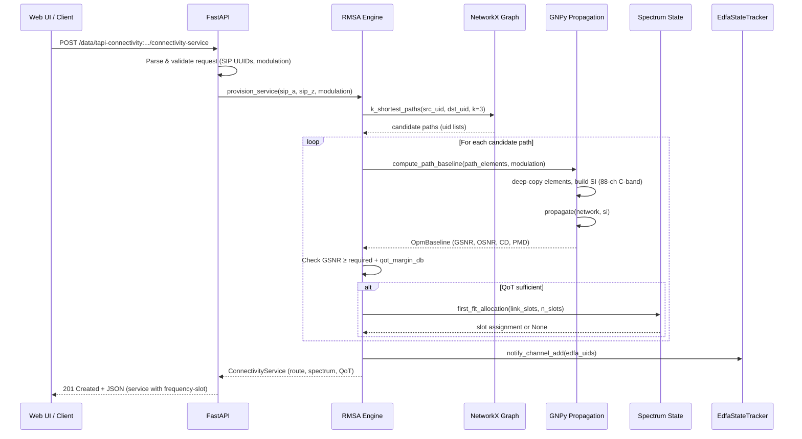
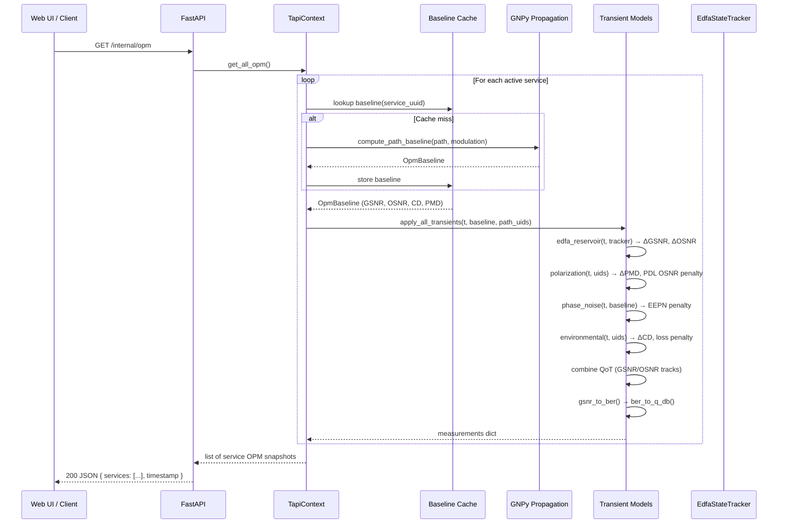
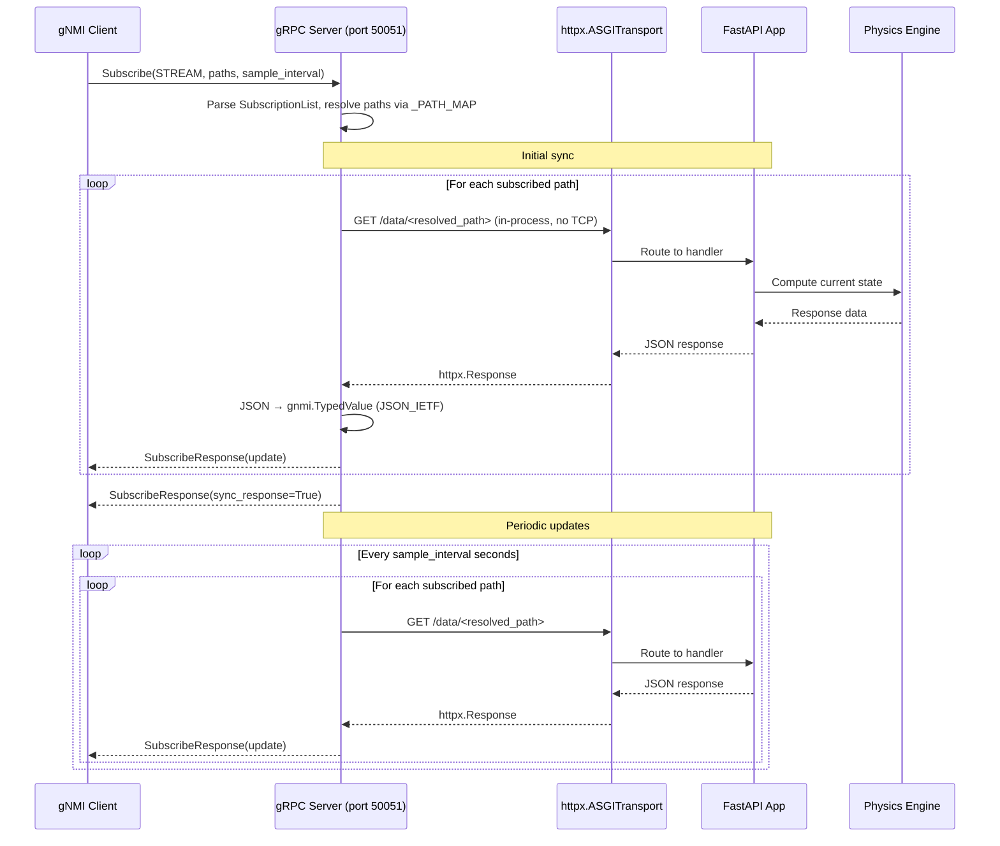
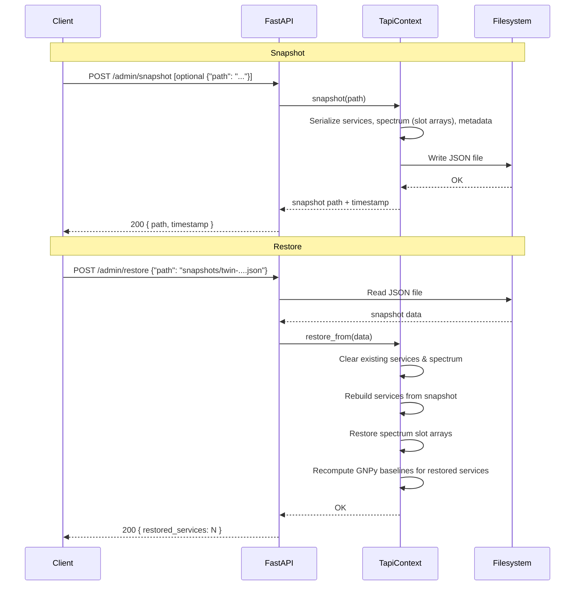

# T-API Network Digital Twin — Implementation Plan

## Context

This project aims to build a **multi-dimensional digital twin for optical networks** that combines GNPy-based long-term QoT estimation with analytical models for real-time optical signal quality fluctuations. The tool exposes T-API-compliant interfaces (REST + gNMI streaming) and generates rich monitoring outputs: OPM metrics, text logs, eye diagrams, and constellation diagrams.

The intended outcome is a standalone Python application that can serve as a realistic emulator of an Optical Domain Controller, enabling validation of SDN control logic, what-if scenarios, and network planning — all through standards-compliant T-API interfaces.

**Key decisions made:**

- Standalone Python app (FastAPI + NetworkX + NumPy), not extending any other project
- GNPy installed from PyPI as a dependency
- MVP is a full vertical slice (topology → QoT → connectivity → streaming → diagrams)
- Statistical synthesis for eye/constellation diagrams
- gNMI over gRPC for telemetry streaming
- C-band only in MVP, extensible design for multi-band
- **gNMI as frontend to FastAPI**: FastAPI owns all state and business logic; gNMI server is a stateless protocol adapter that queries FastAPI internal endpoints and translates JSON → gRPC protobuf streams

---

## Web UI task list

Items in the React SPA that consume T-API or internal APIs:

| Item | Description | Status |
|------|-------------|--------|
| **Equipment** | Equipment view: list and filter equipment from the T-API equipment context (`/data/tapi-equipment:equipment-context/equipment`). | ✓ Implemented |
| **Path** | Path computation view: select A-End and Z-End SIPs, set max candidates, call path computation API and display path result (nodes/links). | ✓ Implemented |

---

## Project Structure

```
t-api-network-digital-twin/
├── src/
│   └── twinlight/                        # Main package
│       ├── __init__.py
│       ├── app.py                        # FastAPI app factory + all state ownership
│       ├── grpc_server.py                # gNMI/gRPC server (stateless, queries FastAPI)
│       ├── main.py                       # Entry point: starts both FastAPI + gRPC
│       ├── config.py                     # Pydantic BaseSettings
│       │
│       ├── models/                       # Pydantic TAPI data models
│       │   ├── common.py                 # UUID, AdminState, OperationalState, NameAndValue
│       │   ├── topology.py              # Topology, Node, Link, NodeEdgePoint, SIP
│       │   ├── connectivity.py          # ConnectivityService, Connection, EndPoint
│       │   ├── path_computation.py      # PathComputationService, Path, constraints
│       │   ├── photonic_media.py        # OTSi, MediaChannel, spectra, fiber/TRX profiles
│       │   ├── streaming.py             # StreamRecord, MeasurementDetails, measurement types
│       │   └── notification.py          # EventNotification, alarm types
│       │
│       ├── state/                        # In-memory state management
│       │   ├── context.py               # TapiContext: root singleton, owned by FastAPI
│       │   ├── topology_state.py        # NetworkX DiGraph + node/link metadata
│       │   ├── spectrum_state.py        # NumPy 2D arrays for slot allocation per link
│       │   ├── connection_state.py      # Active lightpaths, service registry
│       │   └── persistence.py           # Serialization helpers (snapshot/restore)
│       │
│       ├── physics/                      # Physical layer engine
│       │   ├── gnpy_adapter.py          # Wraps GNPy: build network, propagate, extract QoT
│       │   ├── steady_state.py          # Orchestrates GNPy for baseline OSNR/GSNR
│       │   ├── signal_quality.py        # Combines steady-state + transients → instantaneous QoT
│       │   ├── modulation.py            # Modulation formats, thresholds, spectral efficiency
│       │   ├── ber_conversion.py        # GSNR → pre-FEC BER → Q-factor → post-FEC BER
│       │   └── transients/              # Time-varying analytical models
│       │       ├── edfa_reservoir.py    # Sun-Saleh-Zyskind reservoir ODE
│       │       ├── polarization.py      # PMD (Gordon-Kogelnik), PDL hinge model (Zarkosvky-Shtaif)
│       │       ├── phase_noise.py       # Henry linewidth + Wiener + EEPN
│       │       ├── environmental.py     # Thermal dispersion, microbending
│       │       └── cascade.py           # Network-level transient propagation
│       │
│       ├── algorithms/                   # RMSA and path computation
│       │   ├── routing.py               # k-shortest paths (Yen's via NetworkX)
│       │   ├── spectrum_assignment.py   # First-fit, RLE-based slot search
│       │   ├── rmsa.py                  # QoT-aware RMSA orchestration
│       │   └── modulation_selection.py  # Distance/GSNR-based format selection
│       │
│       ├── api/                          # FastAPI routers (TAPI RESTCONF-like)
│       │   ├── common.py               # GET context, SIPs
│       │   ├── topology.py             # GET topologies, nodes, links, NEPs
│       │   ├── connectivity.py         # CRUD connectivity-service
│       │   ├── path_computation.py     # compute-p2p-path RPC
│       │   ├── internal.py             # Internal OPM endpoints (used by gNMI adapter)
│       │   ├── admin.py                # Snapshot/restore endpoints for crash recovery
│       │   ├── streaming.py            # WebSocket fallback for OPM
│       │   ├── diagrams.py             # GET eye-diagram, constellation for a service
│       │   └── middleware.py           # RESTCONF content-type, error handling
│       │
│       ├── streaming/                    # gNMI streaming (stateless frontend)
│       │   ├── gnmi_service.py          # gNMI Subscribe RPC (queries FastAPI)
│       │   ├── proto/                   # Generated protobuf stubs
│       │   └── measurement_sampler.py   # Periodic polling of FastAPI /internal/opm
│       │
│       ├── output/                       # Output generation
│       │   ├── opm_metrics.py           # Generate OPM measurement records
│       │   ├── text_logs.py             # Controller-style log generation
│       │   ├── eye_diagram.py           # Statistical eye diagram synthesis
│       │   └── constellation.py         # Statistical constellation diagram
│       │
│       ├── simulation/                   # Simulation time engine
│       │   ├── clock.py                 # Virtual clock (wall-clock, accelerated, step)
│       │   └── event_engine.py          # Event-driven simulation loop
│       │
│       └── loader/                       # Topology & equipment loading
│           ├── gnpy_topology.py         # GNPy JSON → internal state
│           ├── equipment.py             # GNPy equipment library
│           └── tapi_builder.py          # Internal state → TAPI topology view
│
├── twinlight_client/                          # Companion client library
│   ├── __init__.py
│   ├── client.py                        # TapiClient (httpx async)
│   ├── topology.py                      # Topology query helpers
│   ├── connectivity.py                  # Service CRUD helpers
│   └── streaming.py                     # gNMI streaming consumer
│
├── tests/
│   ├── conftest.py                      # Fixtures: topologies, test client
│   ├── test_models/
│   ├── test_state/
│   ├── test_physics/
│   ├── test_algorithms/
│   ├── test_api/
│   ├── test_streaming/
│   ├── test_output/
│   ├── test_e2e/
│   └── fixtures/                        # JSON topologies, equipment configs
│
├── examples/
│   ├── basic_setup.py                   # Load topology, start server, provision service
│   ├── streaming_demo.py               # gNMI streaming consumer
│   └── diagram_demo.py                 # Generate eye/constellation for a lightpath
│
├── pyproject.toml
├── README.md
├── literature/                          # (existing)
└── related-projects/                    # (existing, reference only)
```

---

## Architecture: gNMI as Frontend to FastAPI

FastAPI **owns all state and business logic**. The gNMI gRPC server is a **stateless protocol adapter** that queries FastAPI's internal OPM endpoints and translates JSON responses into gRPC protobuf streaming updates. Both servers run in the same process.

```
┌──────────────────────────────────────────────────────────────┐
│                         main.py                              │
│                                                              │
│   ┌──────────────────────┐     ┌──────────────────────┐      │
│   │      FastAPI         │     │   gRPC (grpcio.aio)  │      │
│   │     (uvicorn)        │     │   gNMI Subscribe     │      │
│   │                      │     │                      │      │
│   │  T-API REST endpoints│     │  Stateless adapter:  │      │
│   │  + internal OPM APIs │◄────│  polls FastAPI via   │      │
│   │                      │ ASGI│  ASGITransport       │      │
│   │  Owns TapiContext    │     │  (in-process, no TCP)│      │
│   │  Owns all state      │     │  Translates JSON →   │      │
│   │  Owns physics engine │     │  protobuf stream     │      │
│   └──────────────────────┘     └──────────────────────┘      │
│              │                                               │
│      ┌───────▼───────┐                                       │
│      │  TapiContext   │  ← owned exclusively by FastAPI      │
│      │  (state/)      │    no shared-memory coordination     │
│      │               │    no asyncio.Lock needed             │
│      │  topology      │                                      │
│      │  spectrum      │                                      │
│      │  connections   │                                      │
│      │  physics       │                                      │
│      └───────────────┘                                       │
└──────────────────────────────────────────────────────────────┘
```

**Why gNMI-as-frontend**:

- **Single source of truth**: FastAPI owns `TapiContext` exclusively — no shared-memory coordination, no `asyncio.Lock`, no abstract `StateManager`
- **Clean separation**: gNMI is purely a protocol translation layer (REST JSON → gRPC protobuf)
- **Testability**: all business logic testable via FastAPI `TestClient`; gNMI tests only verify protocol translation
- **Negligible overhead**: OPM sampling at 1s intervals; `httpx.AsyncClient` with `ASGITransport` calls FastAPI in-process with zero network overhead (no TCP, no serialization)
- **No external state store needed**: eliminates the Valkey/Redis discussion entirely
- **Future flexibility**: if gNMI ever needs to scale independently, swap `ASGITransport` for a real HTTP target — no other code changes

**How gNMI queries FastAPI** (in-process via ASGI, no network round-trip):

```python
# grpc_server.py
from httpx import AsyncClient, ASGITransport

class GnmiService:
    def __init__(self, fastapi_app):
        self.http = AsyncClient(transport=ASGITransport(app=fastapi_app))

    async def sample_opm(self, service_uuid: str) -> dict:
        resp = await self.http.get(f"/internal/opm/{service_uuid}")
        return resp.json()  # translate to protobuf SubscribeResponse
```

**Internal OPM endpoints** (not exposed externally, used by gNMI adapter):

| Method | Path | Purpose |
|--------|------|---------|
| GET | `/internal/opm/{service_uuid}` | Current OPM snapshot for a service |
| GET | `/internal/opm` | OPM snapshots for all active services |

These internal endpoints call the same physics engine and state that the public T-API endpoints use.

**main.py** starts both:

```python
async def main():
    app = create_app("topology.json", "equipment.json")
    # Optionally restore from a previous snapshot
    if args.restore:
        app.state.context.restore_from(args.restore)
    # Start gRPC server, passing the FastAPI app (not the context)
    grpc_task = asyncio.create_task(start_grpc_server(app, port=50051))
    # Start FastAPI with uvicorn
    config = uvicorn.Config(app, host="0.0.0.0", port=8080)
    server = uvicorn.Server(config)
    await asyncio.gather(grpc_task, server.serve())
```

---

## Communication Diagrams

Time-ordered message flows for key operations, rendered as Mermaid sequence diagrams.

### Service Provisioning (POST connectivity-service)



### OPM Polling (GET /internal/opm)



### gNMI Streaming Subscribe



### Snapshot / Restore



---

## State Persistence & Recovery

FastAPI exposes endpoints to snapshot and restore the full network state, enabling crash recovery and scenario checkpointing.

**Endpoints**:

| Method | Path | Purpose |
|--------|------|---------|
| POST | `/admin/snapshot` | Serialize current state to a JSON file; returns file path |
| POST | `/admin/restore` | Load state from a previously saved snapshot file |
| GET | `/admin/snapshot/latest` | Return path/timestamp of most recent snapshot |

**What gets persisted** (serialized as JSON via Pydantic `.model_dump()`):

- Topology state (node/link metadata, but not the NetworkX graph itself — rebuilt from GNPy JSON on restore)
- Spectrum allocation arrays (per-link slot occupancy, serialized as base64-encoded NumPy)
- Active connectivity services (lightpath routes, assigned slots, modulation format, QoT results)
- Transient model state (current EDFA reservoir values, PMD/PDL sample state, simulation clock position)
- Event engine queue (pending events with timestamps)

**What does NOT get persisted** (reconstructed on restore):

- GNPy network object (rebuilt from topology JSON + equipment JSON)
- gNMI subscriptions (clients must re-subscribe after restart)
- Cached QoT computations (recomputed on demand)

**Implementation approach**:

```python
# state/context.py
class TapiContext:
    def snapshot(self, path: Path) -> Path:
        """Serialize full state to JSON file."""
        data = {
            "version": 1,
            "timestamp": datetime.utcnow().isoformat(),
            "topology_json": self.topology_json_path,
            "equipment_json": self.equipment_json_path,
            "spectrum": self.spectrum_state.to_dict(),      # slot arrays → base64
            "connections": self.connection_state.to_dict(),  # services + lightpaths
            "transients": self.transient_state.to_dict(),    # model state vectors
            "clock": self.clock.to_dict(),                   # simulation time
            "events": self.event_engine.to_dict(),           # pending event queue
        }
        path.write_text(json.dumps(data, indent=2))
        return path

    def restore_from(self, path: Path):
        """Restore state from a snapshot file."""
        data = json.loads(path.read_text())
        self.spectrum_state.from_dict(data["spectrum"])
        self.connection_state.from_dict(data["connections"])
        self.transient_state.from_dict(data["transients"])
        self.clock.from_dict(data["clock"])
        self.event_engine.from_dict(data["events"])
```

**Auto-snapshot** (optional): configurable periodic auto-save (e.g., every 60s) to a rotating set of snapshot files, so the latest consistent state is always available for crash recovery.

**CLI usage**:

```bash
# Normal start
python -m twinlight.main --topology topology.json --equipment equipment.json

# Start from a saved snapshot
python -m twinlight.main --topology topology.json --equipment equipment.json --restore snapshots/latest.json
```

**Files to create/modify**:

- `src/twinlight/api/admin.py` — Admin endpoints (snapshot, restore, latest)
- `src/twinlight/state/context.py` — Add `snapshot()` and `restore_from()` methods
- `src/twinlight/state/persistence.py` — Serialization helpers (NumPy→base64, event queue→JSON)
- Modify `src/twinlight/main.py` — Add `--restore` CLI argument

**Phase**: This fits naturally into **Phase 1** (context.py + persistence.py foundation) with the admin endpoints added in **Phase 3** (when connection_state exists and there's meaningful state to persist).

---

## Implementation Phases

### Phase 1: Foundation — Topology + TAPI Read Endpoints

**Goal**: Load a GNPy JSON topology, build internal state, expose TAPI topology endpoints.

**Files to create**:

- `src/twinlight/models/common.py` — TAPI common types (UUID, AdminState, NameAndValue)
- `src/twinlight/models/topology.py` — Topology, Node, Link, NEP, SIP
- `src/twinlight/state/context.py` — TapiContext singleton
- `src/twinlight/state/topology_state.py` — NetworkX DiGraph wrapper
- `src/twinlight/state/spectrum_state.py` — NumPy slot arrays
- `src/twinlight/loader/gnpy_topology.py` — Parse GNPy JSON → internal state
- `src/twinlight/loader/equipment.py` — Parse GNPy equipment config
- `src/twinlight/loader/tapi_builder.py` — Internal state → TAPI model objects
- `src/twinlight/api/topology.py` — GET topologies, nodes, links, NEPs
- `src/twinlight/api/common.py` — GET context, SIPs
- `src/twinlight/api/middleware.py` — RESTCONF content-type
- `src/twinlight/app.py` — FastAPI factory
- `src/twinlight/config.py` — Settings
- `pyproject.toml` — Dependencies

**TAPI endpoints (Tier 1)**:

| Method | Path |
|--------|------|
| GET | `/data/tapi-common:context` |
| GET | `/data/tapi-common:context/service-interface-point` |
| GET | `/data/tapi-common:context/service-interface-point={uuid}` |
| GET | `/data/tapi-common:context/tapi-topology:topology-context` |
| GET | `.../topology={uuid}` |
| GET | `.../topology={uuid}/node={uuid}` |
| GET | `.../topology={uuid}/link={uuid}` |
| GET | `.../node={uuid}/owned-node-edge-point={uuid}` |

**TAPI model mapping** (derived from `related-projects/TAPI/YANG/tapi-topology.yang`):

- GNPy Transceiver → TAPI Node with 1 NEP + 1 SIP (client-side demarcation)
- GNPy Roadm → TAPI Node with N NEPs (one per degree/direction)
- GNPy Fiber+Edfa spans between ROADMs → TAPI Link connecting NEPs
- Each NEP has `layer-protocol-name: PHOTONIC_MEDIA`

**Topology input format**: GNPy JSON (elements[] + connections[]). Reference: `related-projects/oopt-gnpy/gnpy/example-data/edfa_example_network.json`

**Key dependency**: `gnpy` from PyPI for `gnpy.tools.json_io.load_equipment`, `gnpy.tools.json_io.load_network`

**Tests**: Topology loading, TAPI JSON serialization round-trips, API smoke tests with FastAPI TestClient.

---

### Phase 2: GNPy Integration — Steady-State QoT

**Goal**: Compute OSNR/GSNR for any path through the network using GNPy. Especially relevant when running the provisioning of new optical lightpaths. The software should use a well-defined software interface where other methods for computation can be implemented, such as the partially-loaded GN model.

**Files to create**:

- `src/twinlight/physics/gnpy_adapter.py` — Core GNPy integration
- `src/twinlight/physics/steady_state.py` — Multi-lightpath QoT orchestration
- `src/twinlight/physics/modulation.py` — Modulation format library
- `src/twinlight/physics/ber_conversion.py` — GSNR → BER → Q-factor

**GNPy integration approach**:

```python
# gnpy_adapter.py
from gnpy.tools.json_io import load_equipment, load_network
from gnpy.core.network import build_network
from gnpy.core.info import create_input_spectral_information

class GnpyAdapter:
    def __init__(self, topology_json, equipment_json):
        self.equipment = load_equipment(equipment_json)
        self.network = load_network(topology_json, self.equipment)
        build_network(self.network, self.equipment, ...)

    def compute_path_qot(self, path_element_uids, wdm_channels):
        si = create_input_spectral_information(...)
        for uid in path_element_uids:
            element = self.network.nodes[uid]['element']
            si = element(si)  # GNPy __call__ protocol
        return QotResult(
            osnr_db=si.osnr_ase_01nm,
            gsnr_db=si.gsnr_db,
            signal=si.signal, ase=si.ase, nli=si.nli
        )
```

Key GNPy classes to use (reference paths in `related-projects/oopt-gnpy/gnpy/core/`):

- `elements.py`: Transceiver, Fiber, Edfa, Roadm — all implement `__call__(SpectralInformation)`
- `info.py:SpectralInformation` — tracks signal, ASE, NLI per channel; properties: `gsnr_db`, `snr_lin_db`, `osnr_ase_01nm`
- `science_utils.py:NliSolver` — `gn_model_analytic()`, `ggn_spectrally_separated()`

**Modulation format table** (from ONG and papers):

| Format | Spectral Eff (bits/sym/pol) | Min OSNR (dB) | Max reach (km) |
|--------|---------------------------|---------------|----------------|
| DP-BPSK | 1 | 6.0 | 10000 |
| DP-QPSK | 2 | 12.6 | 4000 |
| DP-8QAM | 3 | 18.6 | 2000 |
| DP-16QAM | 4 | 22.4 | 1000 |
| DP-32QAM | 5 | 26.4 | 500 |
| DP-64QAM | 6 | 30.4 | 250 |

**BER conversion** [Curri_2022]:

```
GSNR_eff = GSNR_LP - FP_LP  (dB)
Q_factor_dB = 20 * log10(sqrt(2) * erfc_inv(2 * BER))
pre_FEC_BER = 0.5 * erfc(10^(Q/20) / sqrt(2))
```

**Lightpath QoT accumulation** [Curri_2022, Eqs. 8-13]:

```
GSNR_LP = -10*log10(sum(10^(-GSNR_i/10)))
CD_LP = sum(D_i * L_i)  [ps/nm]
PMD_LP = sqrt(sum(delta_PMD_i^2 * L_i))  [ps]
```

**Tests**: Compare output against GNPy CLI for `edfa_example_network.json` and `CORONET_CONUS_Topology.json`.

---

### Phase 3: RMSA + Connectivity Service

**Goal**: Handle `create-connectivity-service` with QoT-aware routing, modulation, and spectrum assignment.

**Files to create**:

- `src/twinlight/algorithms/routing.py`
- `src/twinlight/algorithms/spectrum_assignment.py`
- `src/twinlight/algorithms/modulation_selection.py`
- `src/twinlight/algorithms/rmsa.py`
- `src/twinlight/state/connection_state.py`
- `src/twinlight/api/connectivity.py`
- `src/twinlight/api/path_computation.py`
- `src/twinlight/models/connectivity.py`
- `src/twinlight/models/path_computation.py`

**RMSA algorithm** (adapted from ONG's SAP-FF-BM at `related-projects/optical-networking-gym/optical_networking_gym/wrappers/qrmsa_gym.py:152`):

1. Compute k-shortest paths between source and destination (Yen's algorithm)
2. For each path (shortest first):
   a. Compute GSNR via GNPy adapter
   b. Select best modulation format that meets GSNR threshold + margin
   c. Calculate required spectrum slots: `ceil(bit_rate / (2 * spectral_eff * slot_bw))`
   d. Find first-fit contiguous slot block (with guard bands) across all links
   e. If found, provision; otherwise try next path
3. If no path works, reject with reason (resources or QoT)

**Spectrum management** (NumPy-based):

- Per directed link: `np.ndarray[bool]` of shape `(num_slots,)`, default 768 slots at 6.25 GHz
- RLE-based contiguous slot search (from ONG's `utils.pyx`)
- Guard band: 1 slot (6.25 GHz) between services
- Atomic allocation: lock, verify, allocate across all links in path

**TAPI endpoints (Tier 2)**:

| Method | Path |
|--------|------|
| POST | `.../tapi-connectivity:connectivity-context/connectivity-service` |
| GET | `.../connectivity-service` |
| GET | `.../connectivity-service={uuid}` |
| DELETE | `.../connectivity-service={uuid}` |
| POST | `/operations/tapi-path-computation:compute-p2p-path` |

**Create connectivity service request** maps to:

```json
{
  "end-point": [
    {"service-interface-point": {"uuid": "<src-sip>"}},
    {"service-interface-point": {"uuid": "<dst-sip>"}}
  ],
  "requested-capacity": {"total-size": {"value": 100, "unit": "GBPS"}}
}
```

**Tests**: RMSA correctness, spectrum fragmentation, admission control (reject when QoT insufficient), concurrent service lifecycle.

---

### Phase 4: Transient Models ✓ Complete

**Goal**: Implement analytical models for time-varying signal quality fluctuations.

**Files created/modified**:

- `src/twinlight/physics/transients/edfa_reservoir.py` — Bononi exponential step + EdfaStateTracker
- `src/twinlight/physics/transients/polarization.py` — PMD drift + Zarkosvky-Shtaif hinge-model PDL OSNR penalty
- `src/twinlight/physics/transients/phase_noise.py` — Shieh-Ho EEPN
- `src/twinlight/physics/transients/environmental.py` — Kato thermal CD + loss
- `src/twinlight/physics/transients/cascade.py` — QoT combiner with GSNR/OSNR tracks
- `src/twinlight/state/context.py` — EdfaStateTracker wiring (add/delete service)
- `src/twinlight/api/internal.py` — passes edfa_tracker to all OPM endpoints
- `src/twinlight/config.py` — new EDFA config fields (gain_per_channel_db, tau_add_factor, tau_drop_factor)

#### 4a. EDFA Reservoir Model [Bononi-Rusch JLT 1998, Sun 1997]

**Implemented**: Exponential step response (Bononi-Rusch Eq. 19) with stateful `EdfaStateTracker`:

```python
# Per-EDFA exponential step (Bononi-Rusch Eq. 19):
# r(t) = r_ss_new + (r_ss_old - r_ss_new) * exp(-(t - t_event) / tau_eff)
#
# Asymmetric time constants (Eq. 29):
# tau_add = tau_ms * tau_add_factor  (~10 µs)
# tau_drop = tau_ms * tau_drop_factor (~100 µs)
#
# Cascade: linear dB accumulation (Sun 1997)
# ΔGSNR_total = N * ΔGSNR_per_edfa
```

`EdfaStateTracker` tracks per-EDFA channel count and last event; wired into `TapiContext.add_service()` / `delete_service()`. Falls back to sinusoidal when no tracker.

#### 4b. Polarization [Gordon-Kogelnik 2000, Zarkosvky-Shtaif 2020, D'Amico OFC 2023, Miotto OFC 2025]

```python
# PMD drift: per-fiber sinusoidal, quadrature sum (Gordon-Kogelnik)
# PDL hinge model (Zarkosvky-Shtaif 2020, Eq. 3-5):
#   per-hinge transfer:  aⱼ = (1 + γⱼ·cosθⱼ) / √(1 - γⱼ²)
#   γⱼ  ← UID-seeded Maxwell-distributed per-hinge PDL (Miotto OFC 2025)
#   θⱼ  ← UID-detuned incommensurate drift period → ergodic alignment
#   cascade aⱼ over ROADM/EDFA hinges; fibers excluded (negligible PDL)
# OSNR penalty depends on ASE distribution (D'Amico OFC 2023):
#   'distributed' (equal ASE per EDFA) | 'rx' (worst case) | 'tx'
```

#### 4c. Phase Noise (EEPN) [Shieh-Ho, Opt. Express 2008, Eq. 33-41]

```python
# EEPN penalty (dispersion-dependent, LO linewidth only):
#   alpha = pi * c / (2 * f0²) * |D_t| * B * Δν_LO
#   penalty = 10 * log10((GSNR * alpha + 1) / (1 - alpha))
# D_t = accumulated CD in s/m (from baseline cd_ps_nm)
# Only LO linewidth matters; Tx phase noise cancels through fiber+equalizer
```

#### 4d. Environmental [Kato et al. Opt. Lett. 2000]

```python
# CD drift: ΔCD = dD/dT * L * ΔT  (Kato 2000)
# Loss variation: Δα = dα/dT * L * ΔT
# Diurnal sinusoidal temperature cycle (24 h default)
```

**QoT Combiner** (`cascade.py:apply_all_transients()`):

```python
# Separate GSNR and OSNR tracks:
# GSNR ← all 4 models (EDFA + PDL + EEPN + Env)
# OSNR ← EDFA + PDL + Env loss (NOT EEPN — DSP domain)
# CD   ← baseline + environmental drift
# PMD  ← baseline + polarization drift
# BER  ← recomputed from perturbed GSNR via gsnr_to_ber()
```

**Tests**: 40 tests in `tests/test_physics/` covering all four models + cascade composition. EDFA exponential decay, asymmetric time constants, cascade accumulation, PDL hinge-model OSNR penalty (per-hinge cascade, ergodic drift, ASE-distribution dependence), EEPN CD-dependence, BER recomputation.

---

### Phase 5: Output Generation + Streaming

**Goal**: Generate all output modalities and expose via gNMI streaming + REST.

**Files to create**:

- `src/twinlight/output/opm_metrics.py`
- `src/twinlight/output/eye_diagram.py`
- `src/twinlight/output/constellation.py`
- `src/twinlight/output/text_logs.py`
- `src/twinlight/api/internal.py` — Internal OPM endpoints (`/internal/opm/{uuid}`) used by gNMI adapter
- `src/twinlight/streaming/gnmi_service.py` — Stateless gNMI Subscribe RPC (queries FastAPI via ASGITransport)
- `src/twinlight/streaming/measurement_sampler.py` — Periodic polling loop + JSON→protobuf translation
- `src/twinlight/streaming/proto/` — Generated protobuf stubs
- `src/twinlight/grpc_server.py` — gRPC server setup (receives FastAPI app reference, not TapiContext)
- `src/twinlight/api/streaming.py` — WebSocket fallback for OPM
- `src/twinlight/api/diagrams.py`

#### OPM Metrics

Measurement types (from `related-projects/TAPI/PROTOBUF/tapi-streaming-performance.proto`):

- OSNR, GSNR (from physics engine)
- pre-FEC BER, post-FEC BER (from ber_conversion)
- Q-factor (from BER)
- DGD / PMD (from polarization model)
- Chromatic dispersion (accumulated CD)
- Optical power (per channel, total)
- Optical gain, tilt (per EDFA)
- Mimick output from optical spectrum analyzer

#### Eye Diagram (Statistical Synthesis)

```python
def generate_eye_diagram(qot: QotResult, modulation: ModulationFormat,
                         n_traces=1000, samples_per_symbol=64) -> np.ndarray:
    T = 1 / modulation.symbol_rate
    t = np.linspace(0, 2*T, 2*samples_per_symbol)

    noise_sigma = sqrt(qot.signal_power / (2 * qot.osnr_linear * B_ref/B_sig))
    jitter_sigma = qot.dgd_ps * 1e-12 / sqrt(3)

    traces = []
    for _ in range(n_traces):
        bits = np.random.randint(0, 2, size=3)
        pulse = raised_cosine(t, T, roll_off=0.2, bits=bits)
        pulse += np.random.normal(0, noise_sigma, len(t))          # ASE+NLI
        pulse *= (1 + np.random.uniform(-qot.pdl_linear/2,
                                         qot.pdl_linear/2))        # PDL
        t_shifted = t + np.random.normal(0, jitter_sigma)           # PMD jitter
        traces.append((t_shifted, pulse))

    return render_density_plot(traces)  # matplotlib density colormap
```

#### Constellation Diagram (Statistical Synthesis)

```python
def generate_constellation(qot: QotResult, modulation: ModulationFormat,
                           n_symbols=10000) -> np.ndarray:
    ideal = modulation.constellation_points  # e.g., 16QAM 4x4 grid
    noise_var = 1 / (2 * qot.gsnr_linear)
    linewidth = qot.laser_linewidth_hz
    T_sym = 1 / modulation.symbol_rate

    received = []
    phase = 0
    for _ in range(n_symbols):
        sym = ideal[np.random.randint(len(ideal))]
        noise = np.sqrt(noise_var) * (np.random.randn() + 1j*np.random.randn())
        phase += np.random.normal(0, np.sqrt(2*np.pi*linewidth*T_sym))
        rx = sym * np.exp(1j*phase) + noise
        received.append(rx)

    return np.array(received)  # render as scatter plot
```

#### gNMI Streaming (Frontend to FastAPI)

Use `grpcio` + `grpcio-tools`. Implement the `gnmi.proto` Subscribe RPC. The gNMI server is a **stateless protocol adapter** — it holds no physics state and owns no business logic. On each sampling interval, it queries FastAPI's internal OPM endpoint via `httpx.AsyncClient(ASGITransport)` and translates the JSON response into a gNMI `SubscribeResponse` protobuf message.

**Data flow per sample tick:**

```
gNMI client → Subscribe(path, interval=1s)
                  │
    ┌─────────────▼───────────────┐
    │  gNMI measurement_sampler   │  (asyncio loop, per subscription)
    │                             │
    │  every interval:            │
    │    resp = await http.get(   │
    │      "/internal/opm/{uuid}")│──► FastAPI internal endpoint
    │    proto = json_to_proto(   │       │
    │      resp.json())           │       ▼
    │    yield SubscribeResponse  │    TapiContext → signal_quality.py
    └─────────────────────────────┘     → instantaneous QoT → JSON
```

```
gNMI Subscribe(stream) {
    path: "/tapi-common:context/tapi-connectivity:connectivity-context/
           connectivity-service={uuid}/opm"
    mode: STREAM
    sample_interval: 1000000000  // 1s in ns
}
```

This approach means **all OPM computation logic lives in FastAPI** — the gNMI server is purely concerned with subscription management and protobuf serialization.

**TAPI endpoints (Tier 3)**:

| Method | Path |
|--------|------|
| GET | `.../connectivity-service={uuid}/opm-snapshot` |
| GET | `.../connectivity-service={uuid}/eye-diagram` |
| GET | `.../connectivity-service={uuid}/constellation` |
| WS | `/streams/opm` (WebSocket fallback) |
| gRPC | `gnmi.gNMI/Subscribe` (port 50051) |

**Tests**: Measurement record structure validation. gNMI subscribe/unsubscribe lifecycle. Visual sanity checks for diagrams.

---

### Phase 6: Simulation Engine + Client Library + Examples

**Goal**: Event-driven simulation, companion client, working examples.

**Files to create**:

- `src/twinlight/simulation/clock.py`
- `src/twinlight/simulation/event_engine.py`
- `src/twinlight/main.py`
- `twinlight_client/client.py`, `twinlight_client/topology.py`, `twinlight_client/connectivity.py`, `twinlight_client/streaming.py`
- `examples/basic_setup.py`, `examples/streaming_demo.py`, `examples/diagram_demo.py`

**Event engine**: Priority queue of `(timestamp, event)`. Events: `ServiceArrival`, `ServiceDeparture`, `FiberCut`, `EdfaFailure`, `ChannelAddDrop`. On each event: update state → trigger physics recomputation → emit measurements via gNMI.

**Client library** (httpx async):

```python
client = TapiClient("http://localhost:8080")
topology = await client.get_topology()
service = await client.create_connectivity_service(src_sip, dst_sip, capacity_gbps=100)
async for measurement in client.stream_opm(service.uuid):
    print(f"GSNR: {measurement.gsnr_db:.1f} dB")
```

---

## Key Reference Files for Implementation

| Purpose | File Path |
|---------|-----------|
| GNPy element protocol | `related-projects/oopt-gnpy/gnpy/core/elements.py` |
| SpectralInformation class | `related-projects/oopt-gnpy/gnpy/core/info.py` |
| NLI solver (GN model) | `related-projects/oopt-gnpy/gnpy/core/science_utils.py` |
| GNPy JSON topology format | `related-projects/oopt-gnpy/gnpy/example-data/edfa_example_network.json` |
| GNPy equipment config | `related-projects/oopt-gnpy/gnpy/example-data/eqpt_config.json` |
| TAPI topology YANG | `related-projects/TAPI/YANG/tapi-topology.yang` |
| TAPI connectivity YANG | `related-projects/TAPI/YANG/tapi-connectivity.yang` |
| TAPI photonic-media YANG | `related-projects/TAPI/YANG/tapi-photonic-media.yang` |
| TAPI streaming proto | `related-projects/TAPI/PROTOBUF/tapi-streaming-performance.proto` |
| TAPI topology OAS | `related-projects/TAPI/OAS/tapi-topology.yaml` |
| ONG RMSA heuristics | `related-projects/optical-networking-gym/.../wrappers/qrmsa_gym.py` |
| ONG OSNR calculation | `related-projects/optical-networking-gym/.../core/osnr.pyx` |
| Analytical models survey | `literature/deep research/Analytical Models for Time-Varying...md` |
| Architecture survey | `literature/deep research/Optical network emulator and digital twin.md` |

---

## Key Physics Citations

Each implemented model should cite its source in code comments:

| Model | Citation Key | Core Equation |
|-------|-------------|---------------|
| GN model (NLI) | Carena_2014 | `G_NLI = P^3 * [kappa_1 + Phi_a*kappa_2 + Psi_a*kappa_3]` |
| GNPy validation | Ferrari_2020 | `GSNR = P_S / (P_ASE + P_NLI)`, <1 dB for 90% of samples |
| LP GSNR accumulation | Curri_2022 | `GSNR_LP = -10*log10(sum(10^(-GSNR_i/10)))` |
| Pulse collision NLI | Dar_2016 | `Delta_a0 = 2i*gamma * sum X_{h,k,m}`, Phi_a values per format |
| EDFA reservoir | Bononi-Rusch (deep research) | `dr/dt = Qp - Qp_out + sum(Qs) - r/tau` |
| EDFA cascade | Sun-Zyskind (deep research) | N coupled ODEs, 28 dB p-p without AGC |
| PMD | Gordon-Kogelnik (deep research) | Maxwell DGD distribution |
| PDL | Zarkosvky-Shtaif 2020 | hinge cascade `a_j = (1 + g_j*cos(th_j)) / sqrt(1 - g_j^2)` |
| Phase noise | Henry (deep research) | `dnu = dnu_ST*(1+alpha^2)` |
| EEPN | Shieh-Ho (deep research) | `sigma^2 = 2*pi*dnu_LO*|beta2|*L*B^2` |
| SRS tilt | Vanholsbeeck_2005 | 10-Lorentzian Raman response, Eq. 16 |
| OCATA (reference) | Sequeira_2023 | GMM constellation features, DNN propagation |
| DT architecture | Vilalta_2023 | T-API + NDT lifecycle, Kafka streaming |
| Field deployment | Borraccini_2023 | GNPy as PHY-DT, EDFA optimization |

---

## Dependencies (pyproject.toml)

```toml
[project]
name = "twinlight"
requires-python = ">=3.13"
dependencies = [
    "fastapi>=0.115",
    "uvicorn[standard]>=0.30",
    "networkx>=3.4",
    "numpy>=2.1",
    "scipy>=1.14",
    "matplotlib>=3.9",
    "pydantic>=2.9",
    "httpx>=0.27",
    "gnpy>=2.8",
    "grpcio>=1.67",
    "grpcio-tools>=1.67",
    "protobuf>=5.28",
]

[project.optional-dependencies]
dev = ["pytest>=8.3", "pytest-asyncio>=0.24", "ruff>=0.7"]
```

---

## Verification Plan

### Per-Phase Verification

1. **Phase 1**: `pytest tests/test_api/test_topology.py` — Load example topology, hit all GET endpoints, validate JSON structure matches TAPI YANG field names.

2. **Phase 2**: `pytest tests/test_physics/test_gnpy_adapter.py` — Compare GSNR output against GNPy CLI for `edfa_example_network.json`. Run GNPy standalone: `gnpy-path-request -e eqpt_config.json edfa_example_network.json` and compare results.

3. **Phase 3**: `pytest tests/test_api/test_connectivity.py` — Full lifecycle: create service → verify spectrum allocated → GET service → DELETE → verify spectrum released. Test blocking on insufficient resources. Test QoT rejection.

4. **Phase 4**: `pytest tests/test_physics/test_transients/` — EDFA step response matches exponential decay with tau~10ms. PMD DGD samples follow Maxwell distribution (Kolmogorov-Smirnov test). Cascade excursion scales linearly with N_amps.

5. **Phase 5**: `pytest tests/test_streaming/` — gNMI subscribe, receive measurements, unsubscribe. Validate measurement types match proto schema. Eye/constellation diagram renders without errors.

6. **Phase 6**: `pytest tests/test_e2e/` — Run full scenario: load CORONET_CONUS topology → provision 5 services → stream OPM for 10s → simulate fiber cut → verify alarm → tear down services.

### End-to-End Demo

```bash
# Terminal 1: Start the digital twin
python -m twinlight.main --topology examples/topology.json --equipment examples/equipment.json

# Terminal 2: Use the client
python examples/basic_setup.py
# Expected: topology loaded, service provisioned, OPM metrics streaming, diagrams generated
```

---

## Information Gaps & Literature Needs

The following items were identified during analysis. Most are addressed by the extracted literature. Remaining gaps:

1. **EDFA reservoir parameters**: Absorption/gain coefficients (alpha_k, gk*) per wavelength are not fully specified in the deep research. **Mitigation**: Derive from GNPy EDFA type parameters (gain_min, gain_max, nf_min, nf_max) using the relationship between NF and inversion level. For MVP, use simplified single-wavelength reservoir with GNPy's gain/NF as boundary conditions.

2. **gNMI proto files**: Need the standard `gnmi.proto` from the OpenConfig gNMI repository. **Mitigation**: Download from `github.com/openconfig/gnmi/proto/gnmi/gnmi.proto` and compile with `grpc_tools.protoc`.

3. **Remaining PDFs not yet extracted**: `Khare_2024`, `Modesto_2026`, `Mohamed_2026`, `Faruk_2024`, `Mayer_2022`, `Wang_2021`, `Wang_2022`, `Wang_2024_DigitaltwinassistedMetaLearning`, `Zhu_2026`. These are likely needed for: multi-band extensions (Khare, Zhu), failure prediction (Mohamed, Mayer), measurement-informed models (Faruk). **Mitigation**: Extract when implementing specific features (multi-band, failure management, model refinement). Not needed for MVP.

4. **TAPI OAS detailed review**: The OpenAPI specs in `related-projects/TAPI/OAS/` should be read in detail during Phase 1 to ensure field names and URL structures match exactly. **Mitigation**: Use the OAS YAML files as the source of truth during implementation.

---

## Current Implementation Status (Updated 2026-03-12)

### Phases Completed
- **Phase 1** (Topology + TAPI Read): ✓ Complete
- **Phase 2** (GNPy Steady-State QoT): ✓ Complete
- **Phase 3** (RMSA + Connectivity): ✓ Complete (includes path computation RPC)
- **Phase 4** (Transient Models): ✓ Complete (literature-accurate formulas: Bononi exponential step EDFA, Shieh-Ho EEPN, Zarkosvky-Shtaif hinge-model PDL, Kato environmental)
- **Phase 5** (Output + Streaming): Partially complete (OPM metrics + gNMI done; eye/constellation not yet)
- **Phase 6** (Simulation Engine + Client): Not started

### Backend Features Implemented Since Initial Plan
- Admin snapshot/restore endpoints (POST/GET)
- Equipment context endpoints
- Photonic media spectrum context
- Path computation with QoT estimates
- Full connectivity CRUD (including PUT, PATCH)
- RESTCONF error format (`ietf-restconf:errors`)
- Physics model corrections (P1–P3 all done):
  - EEPN: Shieh-Ho dispersion-dependent formula (α = π·c/(2f₀²)·|D_t|·B·Δν_LO)
  - PDL: Zarkosvky-Shtaif 2020 hinge model — per-hinge transfer aⱼ = (1+γⱼ·cosθⱼ)/√(1−γⱼ²) cascaded over ROADM/EDFA hinges, UID-seeded Maxwell-distributed per-hinge PDL, ASE-distribution-aware OSNR penalty (D'Amico OFC 2023 / Miotto OFC 2025)
  - EDFA: Bononi-Rusch exponential step with stateful EdfaStateTracker, asymmetric τ_add/τ_drop
  - QoT combiner: separate GSNR/OSNR tracks (EEPN → GSNR only; PDL+Env loss → both)
- 40 physics unit tests (test_physics/ directory)

### Frontend Features Implemented (full list)
- Dashboard, Topology, Device Detail, Link Detail, Monitoring, Services, Add Service,
  Equipment, Spectrum, Spectrum Grid, Path Computation, Settings — all functional
- Constellation/Eye diagram placeholders exist but not rendering

---

## Future Features — Ranked by Impact

### Tier 1: High Impact — Differentiating Features for Visibility

| # | Feature | Description | Literature | Effort |
|---|---------|-------------|-----------|--------|
| ~~1~~ | ~~**Stateful EDFA Reservoir**~~ | ~~Replace sinusoidal model with Bononi exponential step~~ | ~~Bononi 1998, Sun 1997~~ | ✓ Done — `EdfaStateTracker` with exponential step (Eq. 19/29), asymmetric τ_add/τ_drop, linear dB cascade |
| 2 | **Statistical Constellation Diagram Synthesis** | Generate constellation diagrams from GSNR, phase noise, and PMD using GMM model. Render as scatter/density plot. Enables visual QoT feedback. | Sequeira 2023 (OCATA), paper outline §3.3 | Medium |
| 3 | **Statistical Eye Diagram Synthesis** | Generate eye diagrams from raised-cosine pulses with GSNR-derived noise and PMD jitter. Render as density plot. | Paper outline §3.3 | Medium |
| 4 | **C+L Multi-Band Extension** | Extend from C-band to C+L using GNPy's multi-band capabilities. Add ISRS power tilt model. Requires Raman gain profile. | Khare 2024, Buglia 2024, Semrau 2018 | High |
| 5 | **Event-Driven Simulation Engine** | Virtual clock with priority event queue (ServiceArrival, ServiceDeparture, FiberCut, EdfaFailure). Time acceleration. Required for realistic dynamic scenarios. | Wang 2024 (DT survey) | High |
| 6 | **GNPy REST Interface** | Decouple GNPy from in-process Python library calls behind a REST boundary. Enables independent scaling, language-agnostic consumers, and easier GNPy version upgrades. Exact approach TBD: separate microservice, hosted gnpy.app, or internal REST adapter wrapping the current `gnpy_adapter.py`. FastAPI continues to own state and orchestration; GNPy becomes a stateless propagation service called over HTTP. | (architecture evolution) | High |

### Tier 2: Medium Impact — Research Enablers

| # | Feature | Description | Literature | Effort |
|---|---------|-------------|-----------|--------|
| 6 | **Wideband NLI with ISRS** | Replace GNPy's standard GN with closed-form ISRS-GN model for >5 THz bandwidth. Matrix operations for fast evaluation. | Semrau 2019, Buglia 2024 | Medium |
| 7 | **EGN Modulation Format Correction** | Add kurtosis correction term Φ to GN model NLI estimate. Reduces NLI overestimation for QPSK by up to 2 dB. | Dar 2014, Carena 2014 | Medium |
| 8 | **Failure Scenario Library** | Pre-defined failure scenarios: fiber cut, EDFA degradation, ROADM port failure, partial link failure. Inject via API or config. | Mohamed 2026, Mayer 2022 | Medium |
| 9 | **gNMI OPM/Connectivity Subscriptions** | Extend `_PATH_MAP` to cover OPM and connectivity-service paths. Enable streaming of per-service QoT metrics via gNMI. | OpenConfig gNMI spec | Small |
| 10 | **Companion Python Client Library** | `twinlight_client` package with async httpx client, topology/connectivity/streaming helpers. Enables programmatic access and scripting. | (project plan) | Medium |

### Tier 3: Nice-to-Have — Polish and Extended Capabilities

| # | Feature | Description | Literature | Effort |
|---|---------|-------------|-----------|--------|
| 11 | **Geographic Map View** | Render nodes on Leaflet/Mapbox map using lat/lon from GNPy topology metadata. | (UI plan) | Medium |
| 12 | **Post-FEC BER** | Add FEC model (SD-FEC threshold, coding gain) to compute post-FEC BER from pre-FEC BER. | ITU-T G.975.1 | Small |
| 13 | **SOP Drift Model** | Implement state-of-polarization drift model from Czegledi 2016. Per-fiber Wiener process on Poincaré sphere. | Czegledi 2016, Yang 2021 | Medium |
| 14 | **Measurement-Informed Model Refinement** | Grey-box approach: use measured OPM data to calibrate analytical model residuals. | Faruk 2024 | High |
| 15 | **ML-Based QoT Prediction Plugin** | Optional black-box layer for transceiver-specific penalties. Train on synthetic data from the DT itself. | Sequeira 2023, Devigili 2024 | High |
| 16 | **WebSocket OPM Fallback** | Add WebSocket endpoint for browsers that cannot use gNMI/gRPC. | (project plan) | Small |
| 17 | **Temperature-Dependent EDFA Gain** | Model EDFA gain variation with ambient temperature (Berkdemir 2005). | Berkdemir 2005 | Small |
| 18 | **WSS Filtering Transfer Function** | Model ROADM WSS pass-band narrowing and its impact on signal quality through cascaded ROADMs. | Devigili 2025 | Medium |
| 19 | **Optical Spectrum Analyzer Emulation** | Generate per-channel power spectral density plots mimicking an OSA. | (project plan) | Medium |
| 20 | **Multi-DT Federation** | Connect multiple DT instances representing different administrative domains. | Vilalta 2023 | High |

### Analytical Models Not Yet Considered (from literature survey)

| Model | Source | Impact | Description |
|-------|--------|--------|-------------|
| **Inter-channel SRS tilt** | Semrau 2018, Vanholsbeeck 2005 | High for multi-band | Power tilt across WDM channels from stimulated Raman scattering |
| **Delayed NLI accumulation** | Semrau 2021 | Medium | NLI buildup depends on dispersion map, not just total power |
| **Filter concatenation penalty** | Devigili 2025 | Medium | Pass-band narrowing through cascaded ROADMs |
| **Longitudinal power evolution** | Sena 2025 | Medium | Per-span power profile for Raman amplified systems |
| **Microbending loss** | Gambling 1979 | Low | Additional loss from cable installation conditions |
| **Transceiver implementation penalty** | Faruk 2024 | Medium | Gap between ideal and real transceiver performance |
